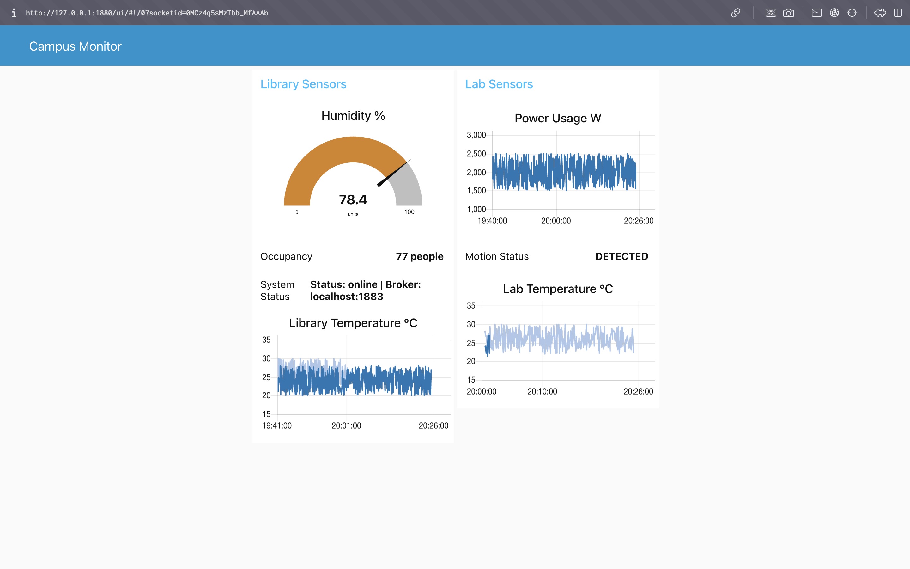

# Smart Campus Monitoring — Node-RED MQTT

A publish-subscribe system built with Node-RED and Mosquitto MQTT broker
that monitors campus sensors in real time.

## Topics

- campus/library/temperature
- campus/library/humidity
- campus/library/occupancy
- campus/lab/temperature
- campus/lab/motion
- campus/lab/power_usage
- campus/system/status

## How to Run

1. Install Mosquitto and start it
2. Install Node-RED
3. Import flow.json into Node-RED
4. Open dashboard at http://localhost:1880/ui

## Dashboard

## QoS

- Sensors: QoS 1 (guaranteed delivery)
- Status: QoS 0 with retain (instant delivery to new subscribers)
